# ⚡ Performance Optimization: Parallel Agentic Workflow

This document explains the technical optimizations implemented to reduce story generation latency by ~60%.

## 🏗️ Architectural Shift

Previously, the pipeline followed a purely sequential "Daisy Chain" pattern. The new architecture implements a **Fan-Out / Fan-In** pattern via `Promise.all`.

### 1. Sequential Generation (Legacy) 🐢
*   Illustration 1 → Audit 1 → Illustration 2 → Audit 2 ...
*   **Latency**: Sum of all model response times.
*   **Observed Time**: ~254 seconds.

### 2. Parallel Generation (Optimized) 🚀
*   **Step A (Fan-Out)**: All 6 illustrations are requested concurrently. 🎨
*   **Step B (Fan-In)**: The system waits for all images to return. 📥
*   **Step C (Fan-Out)**: All 6 Vision Audits are requested concurrently. 🔍
*   **Latency**: Maximum response time of a single request + network overhead.
*   **Target Time**: ~90-100 seconds.

## 🛠️ Performance Levers

| Lever | Strategy | Impact |
| :--- | :--- | :--- |
| **Model Choice** | Switched Vision Audit to `gemini-2.5-flash` | 3x faster analysis than `pro` |
| **Concurrency** | `Promise.all` for illustrations and audits | 6x throughput improvement |
| **Caching** | Pre-warming context cache in parallel with Anchoring | Parallelizes cold-start logic |

## 📈 Projected Results

```mermaid
gantt
    title Pipeline Latency Comparison
    dateFormat  X
    axisFormat %s
    
    section Sequential
    Logic           :0, 40
    Illustrations   :40, 160
    Audits          :160, 220
    
    section Parallel (New)
    Logic           :0, 40
    Illustrations   :40, 70
    Audits          :70, 85
```

